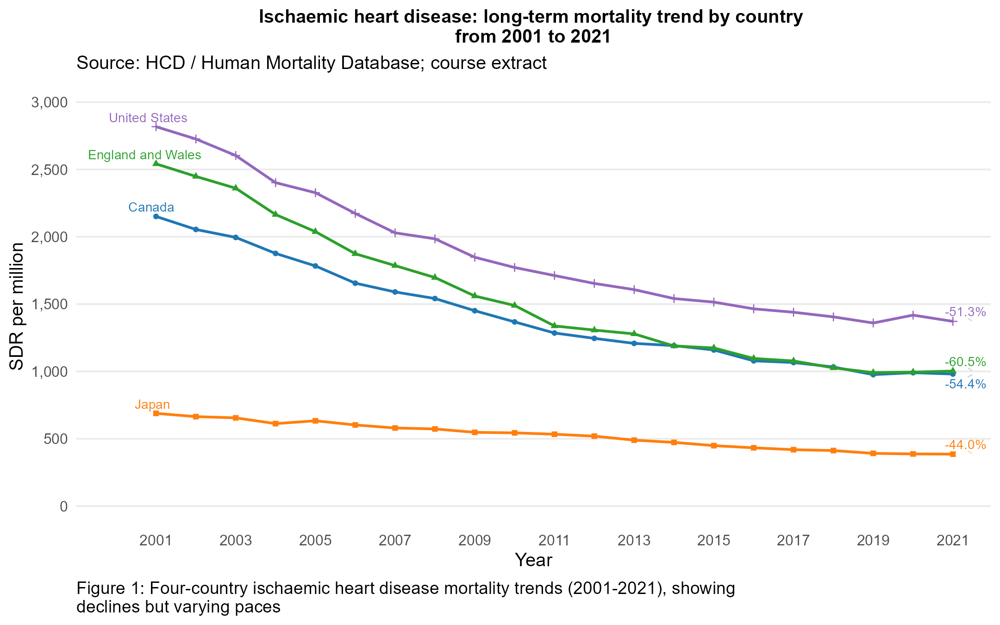
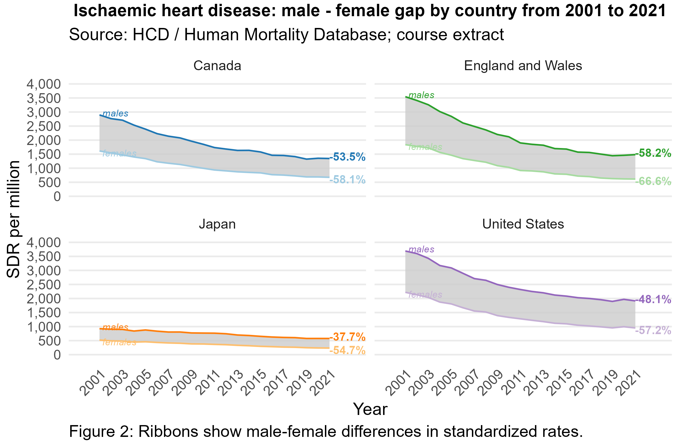
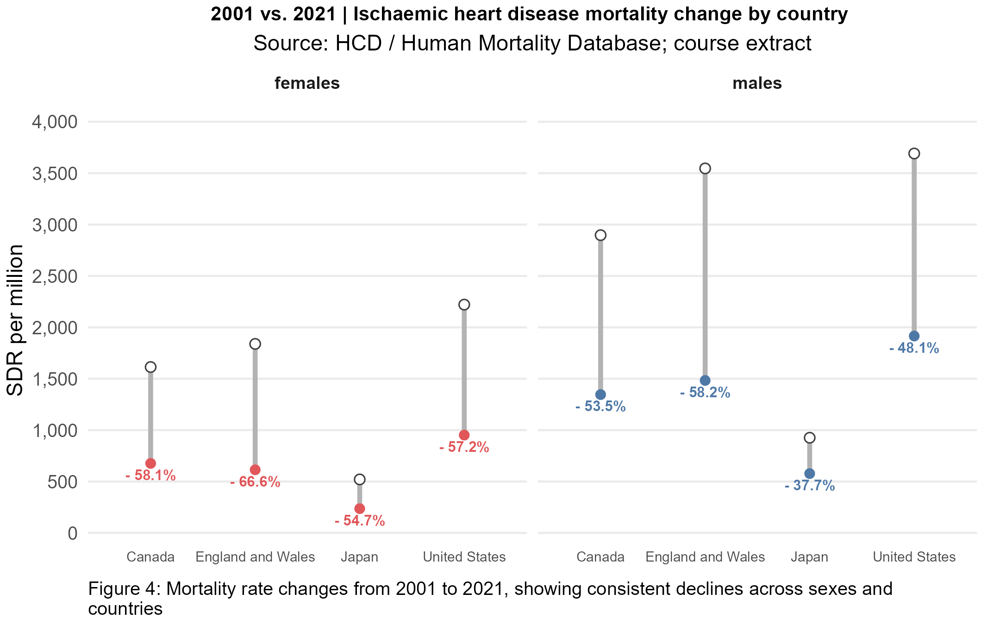

# Ischaemic Heart Disease Mortality in Four Countries, 2001-2021

**R · ggplot2 · R Markdown · Cross-country comparison · Data storytelling**

A collaborative R, ggplot2 and R Markdown project comparing national age-standardized mortality in Canada, England and Wales, Japan and the United States. It asks how overall rates, male-female gaps and age-band rates changed over two decades.

**Read the [HTML report](Report_public.html)** or browse the figures below. Download the HTML and open it in a browser to view the complete report; GitHub displays its source rather than rendering it as a webpage.

## Main findings

| Population | 2001 overall SDR | 2021 overall SDR | Change |
| --- | ---: | ---: | ---: |
| Canada | 2,151.1 | 980.9 | -54.4% |
| England and Wales | 2,541.7 | 1,002.9 | -60.5% |
| Japan | 688.5 | 385.8 | -44.0% |
| United States | 2,817.7 | 1,371.8 | -51.3% |

Rates are per million. Overall rates fell in every country between the endpoints; the US-Japan spread narrowed from approximately 2,129 to 986 per million. Male rates exceeded female rates, and the absolute gap decreased in each country. Women had larger proportional reductions in all four countries. The 65+ band retained the highest standardized rates, but these rates cannot establish the share or number of deaths at older ages.







The report contains five visualizations of overall trends, sex-specific rates, absolute sex gaps, endpoint changes and age-band rates.

## Data and methods

The included [hcd_sdr_filtered.csv](hcd_sdr_filtered.csv) is a frozen course extract containing 1,965 records. It has six columns: country, year, sex, cause, age_group and sdr_per_million. I033 is identified as IHD in the course materials. Analysis uses 2001-2021, three sex categories (`total`, `males`, `females`) and five age categories (`total`, `0-14`, `15-39`, `40-64`, `65 and above`). Its complete analysis grid has 1,260 records with no missing, duplicate or invalid rates.

Data source: Human Cause of Deaths data series (HCD), Human Mortality Database, Max Planck Institute for Demographic Research, University of California, Berkeley, and French Institute for Demographic Studies. See [data provenance, definitions and reuse](DATA_PROVENANCE.md). Following the original course report, the analysis uses the 2013 European Standard Population designation. HMD-constructed estimates are covered by [CC BY 4.0](https://www.mortality.org/Data/UserAgreement); details about this frozen extract are recorded in the provenance document.

The analysis validates observation keys, selects supplied total rates rather than summing strata, computes endpoint percentage changes and male-minus-female differences, and uses country-colored trends, ribbon small multiples, a difference series, dumbbells and age-band bars. It performs no missing-value filling.

## Repository structure

```text
IHD_Mortality_Analysis/
|-- README.md                         # Project overview, findings and run instructions
|-- Code_public.Rmd                   # R Markdown analysis entry point
|-- Report_public.html                # Executed report; download and open in a browser
|-- hcd_sdr_filtered.csv              # Included frozen analysis dataset
|-- DATA_PROVENANCE.md                # Data definitions, sources and reuse conditions
|-- validation_results.json           # Independent data and arithmetic checks
|-- R_RENDER_VALIDATION.txt           # Successful render, plot checks and artifact fingerprints
|-- endpoint_summary.csv              # Country/sex endpoint rates and percentage changes
|-- .gitignore                        # Excludes local dependencies and temporary outputs
|-- figures/
|   |-- overall-trend.png             # Cross-country overall mortality trends
|   |-- sex-trends.png                # Male/female trajectories by country
|   |-- sex-gap.png                   # Absolute male-female rate differences
|   |-- endpoint-comparison.png       # 2001 versus 2021 comparison by sex
|   `-- age-band-rates.png            # Age-band standardized rate comparison
`-- scripts/
    |-- install_dependencies.R        # Install missing or outdated R dependencies
    |-- render.R                      # Render HTML, export figures and validate plotted values
    |-- prepare_data.R                # Prepare an alternative combined data extract
    `-- validate_data.py              # Independent CSV and report-number validation
```

Start with `Report_public.html` for the full analysis or `Code_public.Rmd` to inspect the code. The CSV and five chart images are included; no external data download is needed to reproduce this snapshot.

## Run from a clean R session

The required CSV is included in the project root; no separate data download or preparation is needed to reproduce this snapshot. Keep its filename unchanged.

Use an existing R installation supporting `dplyr::across` and ggplot2 `linewidth` (ggplot2 3.4+). Run all commands below from this repository directory. The installer adds missing packages to the ignored `.local-r-library/` folder and updates ggplot2/dplyr only when they are below the required versions. Then render:

```sh
Rscript --vanilla scripts/install_dependencies.R
Rscript --vanilla scripts/render.R
```

The R Markdown HTML output requires Pandoc (normally supplied with RStudio). Rendering updates `Report_public.html` and the five exported charts. The Rmd records `sessionInfo()` and exports five PNG figures. Dependencies are ggplot2, readr, dplyr, tidyr, stringr, scales, ggrepel, knitr and rmarkdown; analysis does not install packages. The tested environment uses R 4.6.1, ggplot2 4.0.3, readr 2.2.0, dplyr 1.2.1, tidyr 1.3.2, stringr 1.6.0, scales 1.4.0, ggrepel 0.9.8, knitr 1.51 and rmarkdown 2.31. The report includes the R session details. The project loads its `.local-r-library` folder when present; that generated library is ignored by Git. If Pandoc is not detected from a command-line R session, set `RSTUDIO_PANDOC` to the folder containing your RStudio-bundled `pandoc.exe`, or render from RStudio. A UTF-8 locale may be needed if your R startup warns about locale settings.

The supplied CSV matches the verified course extract. [Data provenance and preparation instructions](DATA_PROVENANCE.md) document its source, metadata notes, and how to prepare an alternative or updated extract. Independent checks of the included file use Python 3 with only its standard library. The supplied audit is already current. If you change or re-prepare the CSV, run this audit **before** rendering; the render script checks the data checksum and refuses a stale audit. A changed dataset that no longer matches the frozen report also causes validation to stop until figures and narrative are reconciled:

```sh
python scripts/validate_data.py
# Optional comparison with a combined full course-schema source:
python scripts/validate_data.py path/to/hcd_sdr.csv
```

See [validation results](validation_results.json) and [endpoint values](endpoint_summary.csv) for the reproducible data and arithmetic checks. Rendering also checks all 368 plotted observations against the CSV. The checked-in [R rendering validation record](R_RENDER_VALIDATION.txt) records the successful execution time, input and output fingerprints, endpoint checks, plotted-value checks, and R/Pandoc environment. The runner removes any previous success record before starting and writes a new one only after all checks pass. It is a validation summary, not a full console transcript.

## Limitations

This is an observational national comparison, not evidence of intervention effects. Standardized rates are not death counts or healthcare demand. Broad age bands and available binary sex categories hide variation. Coding and reconstruction choices, endpoint selection and pandemic-era fluctuations limit interpretation. Absolute sex gaps and relative rate ratios answer different questions. The frozen course data may differ from revised HCD releases.

## Collaboration and attribution

Original analysis and report: **Bryan Hao Yang Chen and Zhuoyang Li**. Both authors jointly completed all steps of the original project: research-question development, data preparation, exploratory analysis, visualization design and implementation, interpretation, and report writing.

