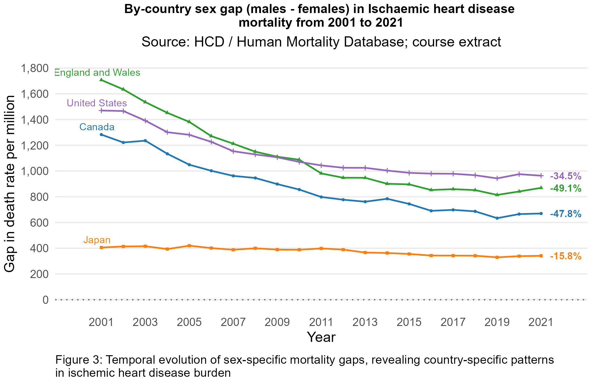
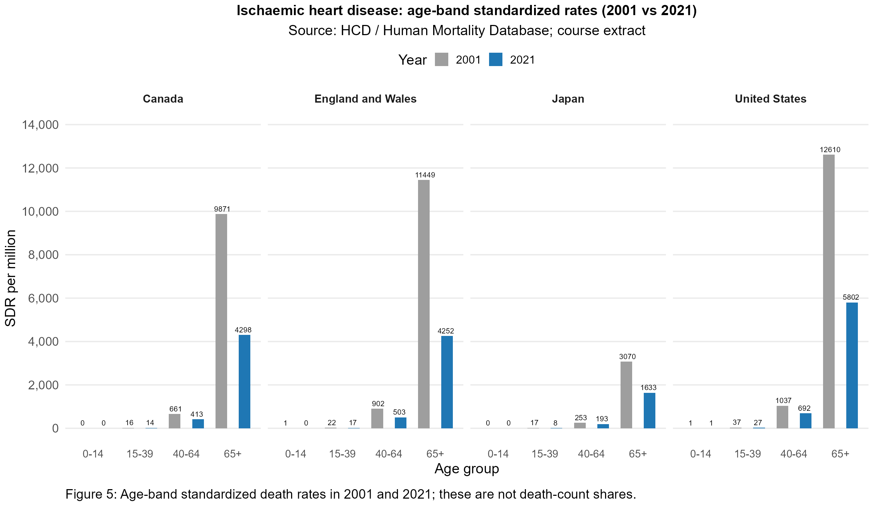

# Ischaemic Heart Disease Mortality in Four Countries, 2001-2021

**Bryan Hao Yang Chen and Zhuoyang Li**

Generated from [Code_public.Rmd](Code_public.Rmd) after numerical validation.

## Research questions and data

How did national IHD mortality rates and absolute male-female gaps change in Canada,
England and Wales, Japan and the United States between 2001 and 2021?
We compare overall trends, sex-specific trajectories, endpoints and age-band rates.
The course extract identifies IHD as I033 and reports SDR per million, not death counts.
Following the original course report, this analysis uses the European Standard Population 2013 designation.
Age-band SDRs are standardized within the respective bands. Neither sex-specific nor
age-band SDRs should be added to obtain a total or normalized into death-count shares.
Source: Human Cause of Deaths data series (HCD), Human Mortality Database,
Max Planck Institute for Demographic Research, University of California, Berkeley,
and French Institute for Demographic Studies; https://www.mortality.org/.
See [DATA_PROVENANCE.md](DATA_PROVENANCE.md) for data definitions, source attribution and reuse terms.

## 1. Overall mortality declines at different speeds

All four overall rates declined. Canada fell from 2,151.1 to 980.9 per million (-54.4%), England and Wales from 2,541.7 to 1,002.9 (-60.5%), Japan from 688.5 to 385.8 (-44.0%), and the United States from 2,817.7 to 1,371.8 (-51.3%). The US-Japan difference narrowed from approximately 2,129 to 986 per million. These are endpoint changes, not an assertion of monotonic decline.

## 2. Male-female gaps narrow within countries

Male rates exceeded female rates in all four countries. Male/female proportional declines were 53.5%/58.1% in Canada, 58.2%/66.6% in England and Wales, 37.7%/54.7% in Japan, and 48.1%/57.2% in the United States. Ribbons show rate differences, not numbers of excess deaths.

## 3. Absolute sex gaps remain in 2021

The absolute male-female SDR gap decreased by 47.8% in Canada, 49.1% in England and Wales, 15.8% in Japan, and 34.5% in the United States. Japan had the smallest remaining gap; the United States had the largest. A smaller absolute gap does not necessarily imply a smaller rate ratio.

## 4. Women show larger proportional declines in every country

Women had larger proportional reductions in all four countries. Both sexes declined, and the absolute gap narrowed because the absolute decline in male rates exceeded that in female rates. Larger female percentage reductions alone do not explain absolute-gap convergence. Open circles mark 2001; colored circles mark 2021.

## 5. Age-band standardized rates remain highest at 65+

The 40-64 SDR fell from approximately 661 to 413 in Canada, 902 to 503 in England and Wales, 253 to 193 in Japan, and 1,037 to 692 in the United States. At 65+, the corresponding values were 9,871 to 4,298; 11,449 to 4,252; 3,070 to 1,633; and 12,610 to 5,802. Rates under 40 were low relative to older bands, but low rates do not establish negligible death counts or their causes.

## Limitations and conclusion

This descriptive comparison covers four national populations over 2001-2021. It cannot
identify causal effects of treatments, policies or risk factors, nor show subnational inequalities.
Standardization aids comparisons but does not measure actual deaths or healthcare burden.
Broad age bands hide variation, and the available sex categories are males, females and total.
Cause-of-death coding, reconstruction methods and pandemic-era changes may affect comparisons.
Endpoint percentages conceal intervening fluctuations; absolute sex gaps differ from relative gaps.
The frozen course extract may differ from subsequently revised HCD releases.

Overall SDRs and absolute sex gaps decreased, with persistent differences across countries.
Women experienced larger proportional reductions in all four settings. Age-band SDRs
were highest at 65+, without establishing how deaths were distributed across age groups.

## Joint contribution

Bryan Hao Yang Chen and Zhuoyang Li jointly completed all steps of the original
project: research-question development, data preparation, exploratory analysis,
visualization design and implementation, interpretation, and report writing. Both authors have agreed to joint public presentation and modification of this project.

## Reproducibility

Rendering performs strict coverage, uniqueness and finite-value checks before plotting.
It uses no missing-value imputation and never adds age-band or sex-specific SDRs into totals.
The independent arithmetic audit is in [validation_results.json](validation_results.json)
and [endpoint_summary.csv](endpoint_summary.csv). The tested rendering environment
is recorded in the HTML session information and [rendering validation record](R_RENDER_VALIDATION.txt).
Report_public.html contains the executed analysis.
Run scripts/render.R in a fresh R process to generate Report_public.html, Report_public.md and refresh previews.

