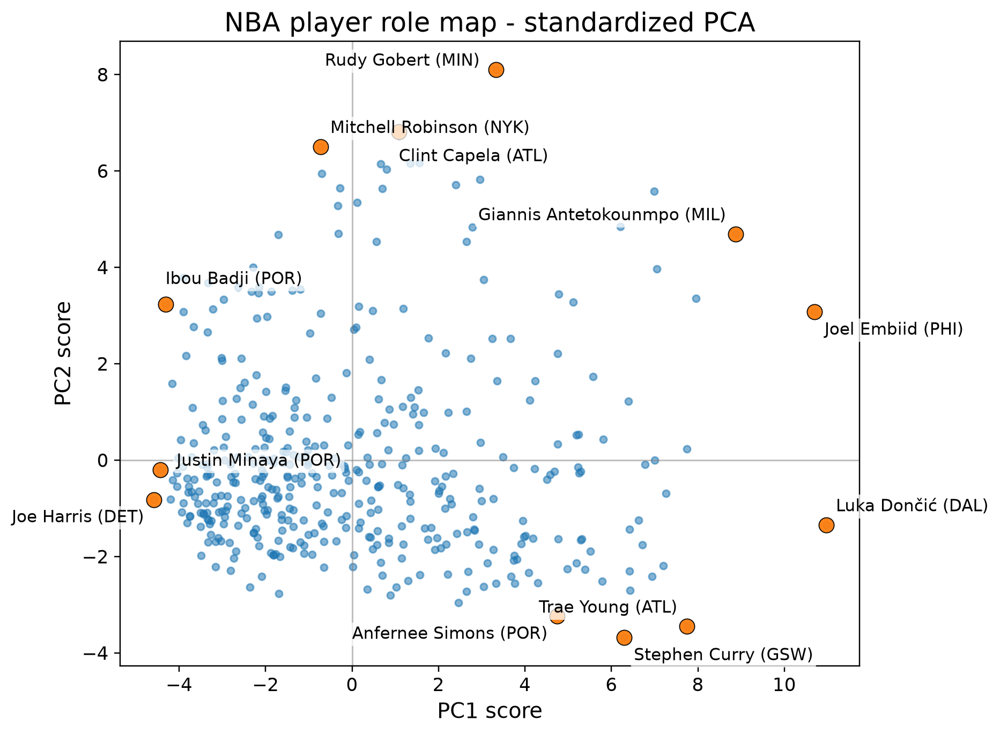
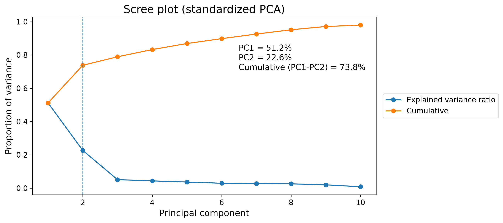
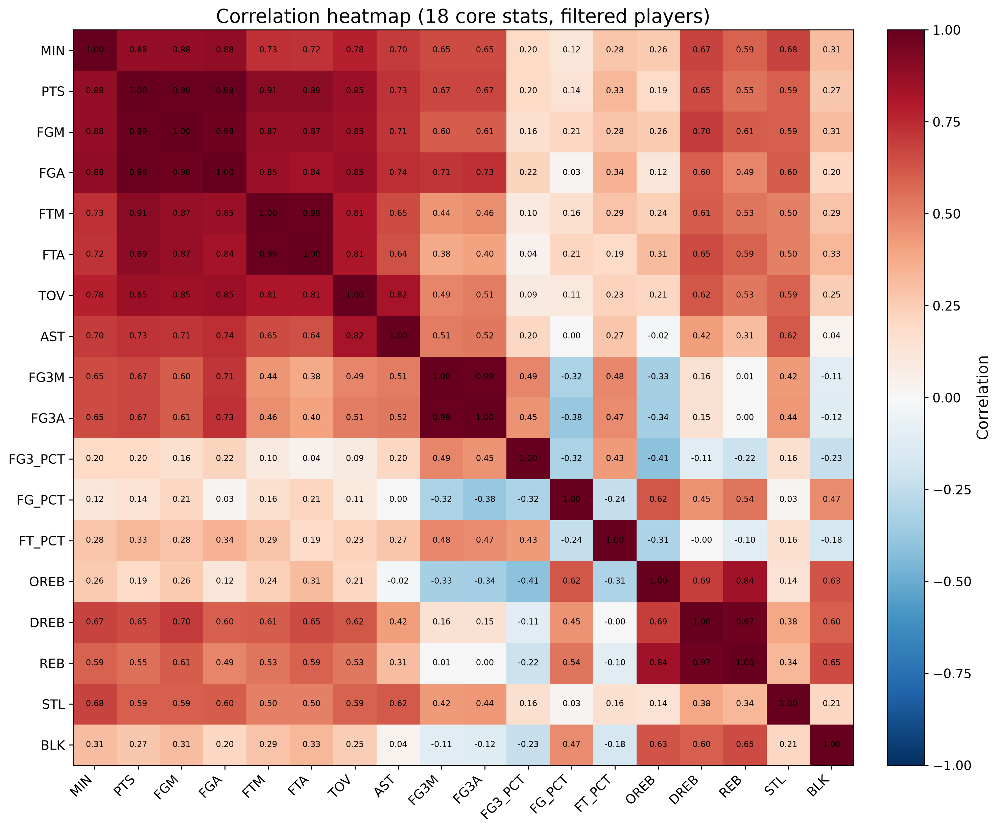

# NBA Player Role Map

An exploratory analysis of **2023–24 NBA player statistics** using Python and standardized principal component analysis (PCA). The project turns 18 correlated box-score measures into a two-dimensional map of player roles, supported by correlation analysis and multivariate diagnostics.

**572 players in the source dataset · 421 players analyzed · 18 features · 73.82% variance explained by two components**

[Analysis notebook](NBA_code.ipynb) · [Updated analysis report](ANALYSIS_REPORT.md) · [Data provenance](DATA_SOURCE.md)

## Project Overview

NBA players contribute in different ways: scoring, creating shots for teammates, rebounding, protecting the rim, or stretching the floor. Comparing these profiles one statistic at a time can obscure the relationships among their contributions.

This project asks:

> Can NBA player statistical profiles be summarized by a small number of interpretable dimensions?

The resulting role map describes both **offensive involvement** and **interior-versus-perimeter style**. It demonstrates data preparation, statistical dimension reduction, diagnostic reasoning, and visual communication.

## Player Role Map



Each point represents a player. Moving right indicates greater offensive involvement; moving upward indicates a more interior-oriented statistical profile. Selected extreme profiles are labeled to help interpret the axes. These positions summarize statistical roles and should not be interpreted as player ability rankings.

## Dataset

**Source:** NBA.com player statistics, supplied as a course dataset for the 2023–24 season. The original CSV is included as [nba_2023_24_stats.csv](nba_2023_24_stats.csv); provenance and usage information are documented in [DATA_SOURCE.md](DATA_SOURCE.md).

| Item | Description |
| --- | --- |
| Unit of analysis | One player’s season-level per-game statistical profile |
| Original snapshot | 572 players, 67 columns |
| Eligibility | At least 10 games played and 10 minutes per game |
| Analysis sample | 421 players |
| Missing-value handling | Remove incomplete selected rows; none were missing in this snapshot |
| Scaling | Center and standardize each of the 18 features before PCA |

| Feature group | Variables |
| --- | --- |
| Playing time | MIN |
| Scoring and shot volume | PTS, FGM, FGA, FTM, FTA |
| Three-point profile | FG3M, FG3A, FG3_PCT |
| Shooting percentages | FG_PCT, FT_PCT |
| Rebounding | OREB, DREB, REB |
| Playmaking and defensive activity | AST, TOV, STL, BLK |

Percentage values retain the source encoding. In the filtered sample, 26 players have recorded FG3A=0 and one has FTA=0. These per-game attempt values are rounded, and percentages without actual attempts should not be interpreted as measured shooting accuracy.

## Analysis Workflow

1. Load the CSV, apply the games/minutes eligibility criteria, and select the 18 core features.
2. Summarize distributions and examine Pearson correlations.
3. Standardize features and fit PCA using full singular value decomposition.
4. Interpret component loadings and plot players in PC1–PC2 space.
5. Assess multivariate normality with approximate Mardia tests and examine Mahalanobis distances.
6. Export figures, statistical tables, and reproducibility evidence.

Component signs are anchored consistently: PC1 is positive toward points and PC2 toward offensive rebounds. Reported loadings are correlations between features and component scores.

## Key Results

| Component | Explained variance | Interpretation | Representative loadings |
| --- | --- | --- | --- |
| PC1 | 51.18% | Offensive involvement | PTS 0.978; FGM 0.971; FGA 0.961; MIN 0.921 |
| PC2 | 22.63% | Interior-versus-perimeter style | OREB 0.866; FG_PCT 0.729; REB 0.687; FG3A −0.649 |
| PC1 + PC2 | **73.82%** | Compact summary of player profiles | Only these two eigenvalues exceed one |

PC1 combines minutes, scoring volume, free throws, assists, and turnovers. It describes involvement rather than the formal basketball usage-rate statistic. PC2 contrasts rebounding, interior finishing, and rim protection with three-point emphasis. Rudy Gobert illustrates the interior side; Stephen Curry illustrates the perimeter side.



Scoring measures move closely together: PTS–FGM has correlation **0.991** and PTS–FGA **0.985**. Rebounding and three-point measures form additional groups of related variables.



The multivariate diagnostics show strong departures from normality: approximate Mardia skewness chi-square **8640.68** (df=1140) and kurtosis z **71.85**, both p < 1e-16. A chi-square(18) 0.999 reference threshold of **42.312** flags **23 player profiles**. These exploratory flags identify unusual statistical combinations; flagged players remain in the analysis.

## Repository Structure

```text
NBA_player_Role_Map/
├── README.md                         # Project overview and results
├── NBA_code.ipynb                    # Executed analysis notebook
├── ANALYSIS_REPORT.md                # Current report with corrected loadings
├── nba_2023_24_stats.csv              # Source data snapshot
├── verify_notebook.py                # Fresh-kernel execution runner
├── requirements.txt                  # Pinned direct dependencies
├── requirements-lock.txt             # Full verification-environment package list
├── figures/
│   ├── Fig1_corr_heatmap_core18_annotated.png
│   ├── Fig2_scree_plot_v3.png
│   ├── Fig3_scores_PC1_PC2_labeled.png
│   └── Fig4_mahalanobis_D2_QQ.png
├── outputs/                          # Summary, loading, extreme-profile and diagnostic tables
│   └── validation.json               # Input hash, versions and verification results
├── DATA_SOURCE.md                    # Provenance and data preparation
├── REPORT_VERIFICATION.md            # Report comparison and loading correction
└── .gitignore                        # Environment, cache and alternate-figure exclusions
```

## Getting Started

The workflow was validated on **Windows with Python 3.12.14**. It uses NumPy, pandas, Matplotlib, scikit-learn, SciPy, and Jupyter execution libraries. Exact tested versions are pinned in [requirements.txt](requirements.txt); other environments have not been tested.

From the portfolio repository root, open a terminal and run:

```powershell
cd NBA_player_Role_Map
python -m venv .venv
.venv/Scripts/python -m pip install -r requirements.txt
.venv/Scripts/python verify_notebook.py
```

The runner uses the included CSV, clears prior notebook outputs, and executes every code cell in a fresh kernel using the selected Python interpreter. It saves the executed notebook and regenerates figures and output tables. A globally registered Jupyter kernel is not required. On Windows systems affected by path-length limits, create the environment in a shorter path and use that environment’s Python for the last two commands.

To edit the notebook interactively, install JupyterLab separately and select the same environment. JupyterLab is optional and is not needed for the execution runner.

## Reproducibility and Report Notes

The included notebook was executed from start to finish in a fresh kernel on 2026-10-01. All nine code cells completed successfully.

[validation.json](outputs/validation.json) records the input SHA-256, Python/package versions, sample size, eigenvalues, explained variance, diagnostic results, and successful checks of standardization, loading correlations, and independently calculated Mahalanobis distances.

The [analysis report](ANALYSIS_REPORT.md), notebook and [loading export](outputs/loadings_PC1_PC2.csv) use the same corrected feature-component correlations. The finite-sample normalization reconciles StandardScaler's population variance with PCA's sample-variance eigenvalues. See [numerical verification](REPORT_VERIFICATION.md) for the method and checks.

## Limitations

- PCA describes associations, not causal effects or future performance. Player positions on the map are not ability rankings.
- Per-game measures reflect playing time and team context; this analysis uses one season and does not normalize by possessions.
- Eligibility criteria exclude players with limited playing time, and zero-attempt percentage encoding affects interpretation of the style axis.
- Redundant box-score measures and rounding create a covariance condition number of about 113,852. Full-dimensional Mahalanobis rankings can therefore be sensitive to small changes.
- In-sample chi-square thresholds and asymptotic Mardia tests are approximate diagnostics. Normality rejection does not establish a specific mixture model, and PCA itself does not require normality.

## Output Files

| File in `outputs/` | Contents |
| --- | --- |
| `summary_stats_core18.csv` | Distribution summaries for all selected features |
| `loadings_PC1_PC2.csv` | Corrected variable-component correlations |
| `extremes_PC1.csv`, `extremes_PC2.csv` | Top/bottom 10 scores on each axis |
| `mahalanobis_D2_all.csv` | Distances for all 421 players |
| `top20_outliers_by_D2.csv` | Twenty largest distances |
| `flagged_outliers_chi2_0p999.csv` | Twenty-three exploratory flags |
| `mardia_test_results.csv` | Approximate skewness and kurtosis diagnostics |
| `validation.json` | Environment, input fingerprint and numerical checks |

Additional corner, loading and biplot figures regenerate locally and are excluded from Git to keep the showcase compact.

## Author and Acknowledgments

**Bryan Chen** · University of Toronto

Originally completed independently for **STA437H1 — Methods for Multivariate Data**. The original report attributes analysis design, methodological choices, execution, and interpretation to the author, with ChatGPT assistance for captions, code, and writing. Subsequent preparation added documentation, reproducibility checks, and the loading normalization correction.

Statistics are attributed to **NBA.com**. Data provenance and usage information are recorded in [DATA_SOURCE.md](DATA_SOURCE.md). No new license is granted to third-party statistics or course materials.
