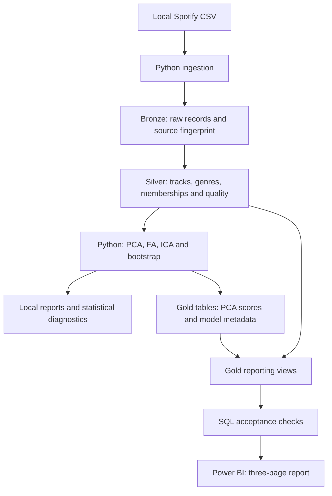
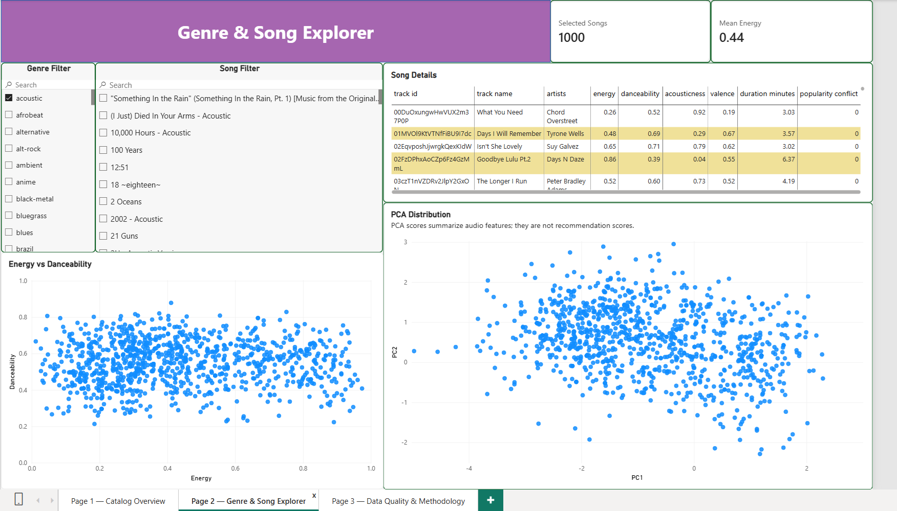
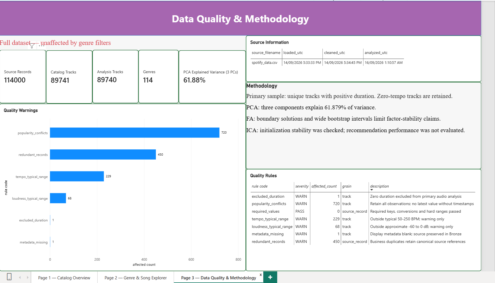

# Spotify Analytics: SQL Data Pipeline & Statistical Analysis

**Python · SQL Server · Batch Data Engineering · Statistical Analysis · Power BI**

A local batch analytics project demonstrating a complete data engineering workflow and rigorous data analysis: Python ingestion, Bronze/Silver/Gold SQL transformations, statistical modeling, and reporting-ready views. Data-quality rules, source lineage and metric definitions support reliable analytical outputs. The workflow runs through six numbered Python/SQL scripts.

**Delivery status:** data pipeline and full statistical analysis validated for the supplied snapshot. A three-page Power BI report is included, with report-definition and screenshot review completed. Live refresh and full interactive acceptance are outside the recorded review scope.

[Findings](reports/ANALYSIS_REPORT.md) · [Architecture](ARCHITECTURE.md) · [Data catalog](DATA_CATALOG.md) · [Validation](reports/VALIDATION.md) · [Reproduce](#quick-start) · [Power BI report](powerbi/README.md)

## Contents

- [Project objectives](#project-objectives)
- [Results](#results)
- [Architecture](#architecture)
- [Engineering and analytical decisions](#engineering-and-analytical-decisions)
- [Technology stack](#technology-stack)
- [Quick start](#quick-start)
- [Repository structure](#repository-structure)
- [Power BI report](#power-bi-report)
- [Limitations and next steps](#limitations-and-next-steps)
- [Data and provenance](#data-and-provenance)

## Project objectives

1. Build a reproducible path from raw CSV records to validated SQL reporting views, with explicit data grains and transactional writes.
2. Analyze audio-feature patterns using descriptive statistics, PCA and complementary FA/ICA diagnostics.
3. Prepare reliable song and genre metrics for Power BI, including correct aggregation across overlapping genre memberships.
4. Support the pipeline with documented quality rules, source fingerprints and row-level traceability.

The primary focus is **data engineering and data analysis**. Governance concepts are applied through quality and provenance controls; this is not an enterprise governance-platform implementation.

## Results

| Validated result | Value |
|---|---:|
| Source records | 114,000 |
| Unique catalog tracks | 89,741 |
| Track–genre memberships | 113,550 |
| Genres | 114 |
| Eligible analysis tracks | 89,740 |
| First three PCs: explained variance | 61.8790% |

The pipeline identifies **450 redundant source records** and **720 tracks with conflicting popularity observations**, preserving both as traceable evidence. PCA, FA and ICA score exports retain track IDs and reconcile with the same cleaned sample.

Three-dimensional PCA is the primary exploratory representation. FA boundary solutions and wide bootstrap intervals limit claims of stable latent factors; ICA initialization stability does not establish recommendation performance. See the [analysis report](reports/ANALYSIS_REPORT.md) for findings and limitations and [validation evidence](reports/VALIDATION.md) for the execution scope.

## Architecture



The SQL Server database is **Spotify**. Bronze preserves source rows; Silver separates validated entities and lineage; Gold joins analytical results into reporting views. Layer table counts differ because their responsibilities differ. Python-computed PCA scores are persisted in Gold tables, while reporting attributes are exposed through views joining Silver.

[Full object inventory and data grains](ARCHITECTURE.md) · [Audio feature definitions](DATA_CATALOG.md#nine-audio-features-plain-language-guide)

## Engineering and analytical decisions

| Area | Implementation | Why it matters |
|---|---|---|
| Ingestion | Parameterized inserts and transactional snapshot replacement | Avoids partial committed source loads |
| Data model | Separate tracks, genres and memberships | Preserves many-to-many genre assignments |
| Supporting quality controls | Source hashes, canonical references and rejected-row evidence | Makes transformations and exceptions traceable |
| Metrics | Distinct-track counts and per-track feature averages | Prevents multi-genre tracks from being overweighted |
| Model integration | Keyed score write-back and sample identity checks | Keeps reporting features aligned with current Silver data |
| Statistical validation | Parallel analysis, bootstrap and paired-start diagnostics | Tests interpretation rather than relying on attractive loadings |

The current workflow is a manual, sequential batch pipeline. It demonstrates ingestion, transformation, model integration and acceptance within a local SQL Server environment. Cloud orchestration, live API ingestion, streaming, immutable run history and concurrent writers are outside its implemented scope.

## Technology stack

| Component | Tools |
|---|---|
| Ingestion and analysis | Python 3.12, pandas, NumPy, pyodbc |
| Statistical methods | scikit-learn, SciPy, factor-analyzer, Matplotlib |
| Storage and transformations | SQL Server, T-SQL, SSMS |
| Local development | VS Code, Python virtual environment |
| Reporting | Power BI Desktop report, DAX measures and report previews |

Dependencies are pinned in [requirements.txt](requirements.txt) and [requirements-latent.txt](requirements-latent.txt).

## Quick start

Prerequisites: SQL Server Database Engine, SSMS, Python 3.12 and Microsoft ODBC Driver 18. From this project directory, create a short-path environment and install the complete analytical dependencies:

```powershell
py -3.12 -m venv C:\venvs\spotify
& C:\venvs\spotify\Scripts\python.exe -m pip install -r requirements-latent.txt
```

Set `SERVER` in both Python entry files to the available SQL Server instance (the supplied example is `localhost\SQLEXPRESS`). Windows authentication is used. Select the created Python interpreter for Steps 02 and 04. Step 04 enables full analysis with `RUN_ADVANCED_ANALYSIS=True`. Execute the following files in order:

| Step | File | Environment | Result |
|---|---|---|---|
| 01 | [01_create_layers.sql](01_create_layers.sql) | SSMS | Database and layer tables |
| 02 | [02_import_csv.py](02_import_csv.py) | Python | Raw snapshot and provenance |
| 03 | [03_clean_silver.sql](03_clean_silver.sql) | SSMS | Validated Silver entities |
| 04 | [04_audio_analysis.py](04_audio_analysis.py) | Python | Statistical reports and keyed model output |
| 05 | [05_gold_views.sql](05_gold_views.sql) | SSMS | Reporting views |
| 06 | [06_checks.sql](06_checks.sql) | SSMS | Reconciliation and acceptance results |

Re-running ingestion replaces the current snapshot and clears derived data. Use the dedicated `Spotify` database and run stages sequentially. File paths are resolved relative to the scripts; the project does not depend on its original parent repository. Moving files does not require reloading an already accepted database. Step 04 recreates the ignored `outputs/` directory.

## Repository structure

```text
Project_2_Spotify_Audio_Features_Analysis/
├── README.md
├── 01_create_layers.sql
├── 02_import_csv.py
├── 03_clean_silver.sql
├── 04_audio_analysis.py
├── 05_gold_views.sql
├── 06_checks.sql
├── DATA_CATALOG.md
├── ARCHITECTURE.md
├── QUALITY_RULES.md
├── requirements.txt
├── requirements-latent.txt
├── spotify_data.csv
├── research/             # Statistical helpers called by Step 04
├── reports/              # Findings, acceptance scope and compact evidence
├── powerbi/              # PBIX, previews, model documentation and DAX
├── outputs/              # Generated local results; excluded from Git
└── spotify_README.pdf    # Supplied dataset documentation
```

## Power BI report

[Download the Power BI report](powerbi/Spotify_Audio_Analytics.pbix) · [Report model and metric contract](powerbi/README.md)

The report contains three pages. `GenreSongs` supplies track-level exploration across genre memberships; `DataQuality` and `SourceSummary` supply full-snapshot quality and provenance panels. No public interactive service link is currently provided.

### Catalog Overview

Distinct-song counts, genre coverage and audio-feature comparisons. Genre counts overlap; total measures count each track once.


### Genre & Song Explorer

Song-level features and PCA coordinates, shown with the acoustic genre selected. PCA coordinates describe feature structure, not recommendation performance.



### Data Quality & Methodology

Full-snapshot counts, six warning rules, source metadata and statistical limitations. Quality counts have different grains and are not summed into a unique-song error total.



Previews show the report state supplied on 19 September 2026. Opening the saved report and refreshing its data are separate operations: refresh requires the SQL Server database and Gold views. See [validation scope](reports/VALIDATION.md) for completed checks and remaining runtime checks.

## Limitations and next steps

- Recorded Power BI review covers report configuration and supplied screenshots; live refresh and exhaustive filter testing remain unverified.
- Preserve FA boundary/bootstrap caveats in report captions and interpretation.
- Do not infer time trends, market share or user recommendation outcomes from this catalog snapshot.
- Treat source load timestamps as pipeline events, not Spotify observation dates.

## Data and provenance

The supplied [dataset guide](spotify_README.pdf) documents the source snapshot. Current findings, limitations and retained execution evidence are in `reports/`.

Source and sample fingerprints are recorded in the validation evidence. Independent dataset licensing verification is not asserted; verify redistribution rights before publishing report data publicly. This educational portfolio project is not affiliated with Spotify. No new software or dataset license is granted by this README.
