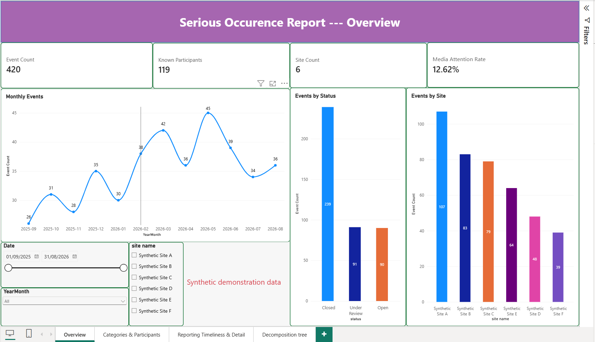
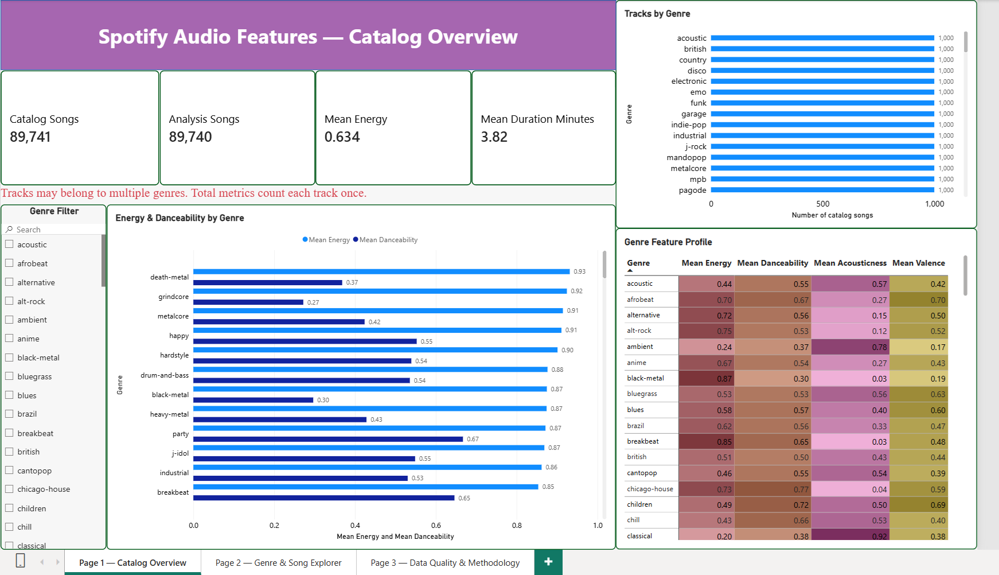

# Data Analytics & Engineering Portfolio

**SQL Server · Python · SSIS · Power BI · DAX · Statistical Analysis**

Projects demonstrating how raw data becomes validated, interpretable reporting through data pipelines, quality checks, statistical analysis and Power BI dashboards.

Each project includes source code, reproduction instructions, validation evidence and report previews.

## Featured Projects

| Project | Focus | Key Results |
|---|---|---|
| [Serious Occurrence Reporting](Serious_Occurance_Report_Analysis/README.md) | Internship-derived SSIS pipeline, data quality and operational reporting | Transactional Silver refresh; 19 SQL tests and 5 SSIS checks passed; four-page Power BI report |
| [Spotify Analytics](Spotify_Audio_Features_Analysis/README.md) | Python/SQL pipeline, audio-feature analysis and catalog reporting | 114,000 records processed into 89,741 unique tracks; PCA and complementary diagnostics; three-page Power BI report |

## 1. Serious Occurrence Reporting

**SSIS · SQL Server · T-SQL · PowerShell · Power BI**

An internship-derived project that transforms event-status and category exports through Bronze, Silver and Gold layers for reporting.

The original workflow was implemented and deployed during the internship. This public version adds subsequent engineering enhancements and a reproducible synthetic dataset.

### Key Features

- **Data validation:** checks event-key uniqueness, required identifiers, category-to-event references, date formats and nonnegative quantities.
- **Failure recovery:** refreshes both Silver tables in one transaction, preserving the previous published snapshot if validation or loading fails.
- **Reporting accuracy:** separates event and category records to prevent repeated classifications from inflating event counts or average reporting delays.
- **Automated verification:** passes 19 SQL acceptance tests and 5 SSIS checks, including invalid-input rejection and rollback after a mid-write failure.
- **Power BI reporting:** four pages cover event volume, categories and participants, reporting timeliness, and decomposition analysis.

**Data confidentiality:** original operational data and the internship report are not published because of sensitivity and confidentiality requirements. The public demonstration uses independently generated fictional records: **420 events and 855 category records across 12 months and six sites**. These are demonstration values, not organizational results.

[Project Documentation](Serious_Occurance_Report_Analysis/README.md) · [Validation](Serious_Occurance_Report_Analysis/docs/VALIDATION.md) · [Power BI Report](Serious_Occurance_Report_Analysis/powerbi/SOR_analysis.pbix)

## 2. Spotify Analytics

**Python · SQL Server · pandas · scikit-learn · Power BI**

A batch analytics project combining a Bronze–Silver–Gold data pipeline with statistical exploration of audio features and reporting across overlapping genres.

### Key Features

- **Data processing:** transforms **114,000 source records into 89,741 unique tracks**, retaining track–genre relationships across 114 genres.
- **Quality and traceability:** identifies **450 redundant records** and **720 tracks with conflicting popularity observations**, preserving evidence and source lineage.
- **Statistical analysis:** applies PCA to nine audio features; the first three components explain **61.88% of variance**. Factor analysis, ICA and bootstrap diagnostics provide complementary checks.
- **Model integration:** writes analytical scores back to SQL Server with track identifiers and sample reconciliation.
- **Power BI reporting:** three pages explore the catalog, genres and songs, and data quality; DAX measures account for overlapping genre memberships.

PCA describes variation in audio features. It does not establish recommendation performance or causal relationships, and the analysis documents the limitations of its complementary methods.

[Project Documentation](Spotify_Audio_Features_Analysis/README.md) · [Analysis Findings](Spotify_Audio_Features_Analysis/reports/ANALYSIS_REPORT.md) · [Power BI Report](Spotify_Audio_Features_Analysis/powerbi/Spotify_Audio_Analytics.pbix)

## Skills Demonstrated

| Area | Implementation Examples |
|---|---|
| Data Engineering | Python and SSIS ingestion, layered SQL transformations, transactional snapshot loading |
| Data Quality | Key constraints, validation rules, source fingerprints, reconciliation and failure tests |
| Data Modeling | Separate event/category and track/genre grains; explicit relationships and aggregation rules |
| Data Analysis | Exploratory analysis, PCA, FA, ICA and statistical diagnostics |
| Business Intelligence | Power BI data models, DAX measures, filtering and interactive report pages |
| Reproducibility | Execution scripts, documented dependencies, test fixtures and validation evidence |

## Explore or Reproduce

1. Open a project README for its objectives, architecture and results.
2. View the report screenshots or download the PBIX file to explore it in Power BI Desktop.
3. Follow the project-specific setup instructions to reproduce its pipeline.

The saved Power BI reports contain imported data. Refreshing them requires the corresponding SQL Server database and connection configuration.

Pipeline execution and recorded report reviews are documented within each project. The project author has confirmed successful Power BI Desktop refresh and full interactive acceptance for both reports. Data provenance, usage conditions and project-specific limitations are described in the respective READMEs.
