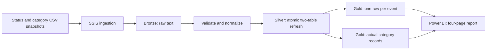
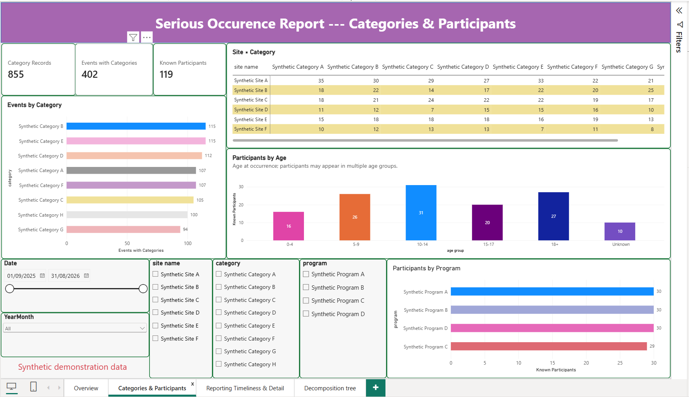
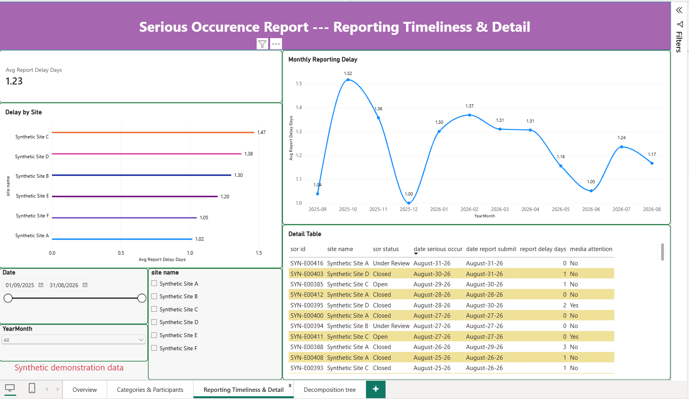
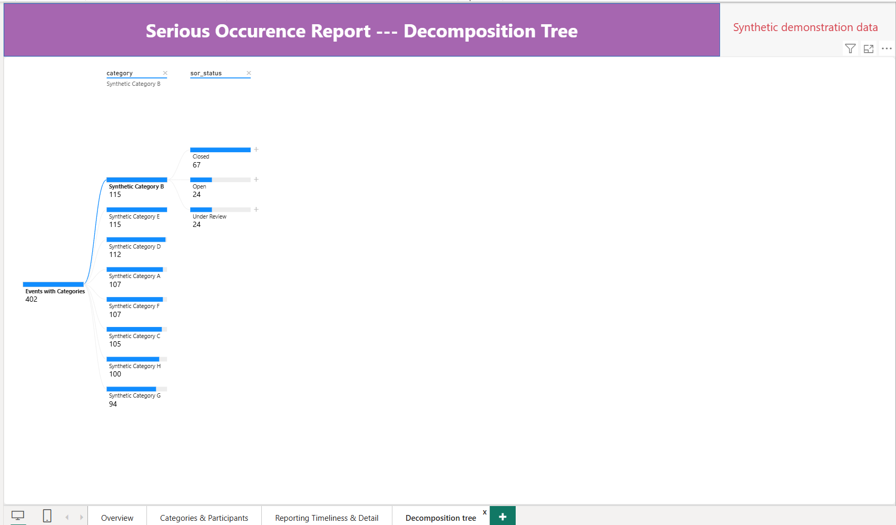

# Serious Occurrence Reporting: SSIS Data Pipeline & Power BI

**SSIS · SQL Server · T-SQL · Data Quality · Power BI · DAX**

An internship-derived data engineering project that turns event-status and category exports into validated reporting data. SSIS loads CSV snapshots, SQL Server applies Bronze/Silver/Gold transformations, and a four-page Power BI report explores events, participants and reporting timeliness.

The original workflow was implemented and deployed during the internship. This public version keeps that logic and adds post-internship improvements: typed validation, transactional Silver refresh, automated failure tests, separate reporting grains and reproducible synthetic data. Because the original internship data contains sensitive operational information and is subject to confidentiality and data-management requirements, the real database, source records and original Power BI report are not published. This repository instead provides an independently generated synthetic database, `SOR_Portfolio_Test`, and a Power BI report built from fictional records. The synthetic data is not an anonymized extract of the original records.

**Delivery status:** the local SQL/SSIS workflow and supplied snapshots are validated. The completed Power BI file is included; its saved model, embedded data, report definitions and four supplied screenshots were reviewed. Live Power BI refresh and exhaustive interactive testing are outside the recorded review scope.

[Architecture](docs/ARCHITECTURE.md) · [Data contract](docs/DATA_CONTRACT.md) · [Validation](docs/VALIDATION.md) · [Power BI report](powerbi/README.md) · [Reproduce](#quick-start)

## Project objectives

1. Automate a repeatable path from two source snapshots to reporting-ready SQL views.
2. Reject invalid batches and preserve the previously published Silver data when a refresh fails.
3. Keep event and category-record grains separate so repeated participants and classifications do not inflate event metrics.
4. Demonstrate the reporting workflow without exposing operational data.

The main contribution is the integration of ingestion, validation, transactional loading and correctly defined reporting metrics. Synthetic trends demonstrate the report; they are not findings about the internship organization.

## Validated results

| Showcase result | Value |
|---|---:|
| Occurrence period | September 2025–August 2026 |
| Events | 420 |
| Category records | 855 |
| Events with categories | 402 |
| Known participants | 119 |
| Sites / categories / programs | 6 / 8 / 4 |
| Media-attention events | 53 |
| Media attention rate | 12.62% |
| Average reporting delay | 1.23 calendar days |
| SQL acceptance tests | 19 passed |
| SSIS acceptance checks | 5 passed |

The separate 3-event/4-category fixture supports small, inspectable acceptance tests. The larger showcase supports 12-month visual exploration. Both datasets are entirely fictional. All 18 event fields and 24 category fields in the saved PBIX reconcile with the showcase source projection, comparing times at the source's whole-second precision.

## Architecture



Database: **SOR_Portfolio_Test**. The loader publishes both Silver tables in one transaction. Bronze ingestion is outside that transaction; a failed import can leave partial Bronze data while the previous Silver remains available. Run one ingestion writer at a time.

## Engineering and reporting decisions

| Decision | Implementation | Why it matters |
|---|---|---|
| Preserve the original workflow | SSIS ingestion and full-snapshot Bronze/Silver/Gold processing | Keeps the portfolio traceable to internship work |
| Validate before publishing | Required/unique event IDs, category references, ISO dates, nonnegative quantities and date consistency | Invalid batches fail explicitly |
| Publish Silver atomically | Transaction with rollback across both tables | Avoids partially updated reporting data |
| Separate grains | `gold.fact_events` and `gold.fact_categories` | Event averages are not weighted by category multiplicity |
| Preserve participant repetition | Distinct nonblank IDs for participant metrics | Repeat records are retained without inflating participant totals |
| Represent missing age explicitly | Unknown age group | Missing values do not become the youngest age group |
| Demonstrate safely and reproducibly | Deterministic fictional CSVs and expected hashes/metrics | External readers can reproduce the pipeline |

An event can belong to several categories. A participant can cross age groups over the year. Distinct breakdowns therefore do not necessarily add to the grand total. Reporting delay is the calendar-day difference between occurrence and submission, not elapsed working hours or an SLA assessment.

## Technology stack

| Component | Tools |
|---|---|
| Ingestion | SQL Server Integration Services, standalone DTSX, DTExec 17 |
| Storage and transformation | SQL Server Express, T-SQL, Bronze/Silver/Gold schemas |
| Execution and tests | PowerShell, sqlcmd, Microsoft OLE DB Driver 19 |
| Synthetic data and reconciliation | Python 3 standard library |
| Reporting | Power BI Desktop, Import model, DAX |

## Quick start

To explore the saved report, open [SOR_analysis.pbix](powerbi/SOR_analysis.pbix) in Power BI Desktop. It contains the synthetic snapshot; opening the file does not require running the pipeline. Refresh requires the SQL database and a working local connection.

To reproduce the full pipeline, install SQL Server, `sqlcmd`, DTExec 17, the `MSOLEDBSQL19.1` provider and Python 3. Add the executables to PATH. Use Windows authentication with permission to create the demonstration database. From this project folder:

```powershell
.\run_demo.ps1 -Server '.\SQLEXPRESS'
.\tests\03_ssis_acceptance.ps1 -Server '.\SQLEXPRESS'
.\run_showcase.ps1 -Server '.\SQLEXPRESS'
```

| Step | Result |
|---|---|
| `run_demo.ps1` | Creates the marked demo database, SQL objects and small fixture; executes 19 SQL tests |
| `tests/03_ssis_acceptance.ps1` | Executes CSV ingestion and 5 SSIS acceptance checks |
| `run_showcase.ps1` | Loads the larger showcase through SSIS, reconciles all Gold fields and leaves it ready for Power BI |

The scripts refuse an unmarked existing database and never drop a database. They replace the marked database's snapshots. Running acceptance tests restores the small fixture: run the showcase loader afterward before refreshing the report. Setup supports fresh installation and reruns, not migration of arbitrary existing schemas. Pass `-Python 'C:\path\to\python.exe'` to the showcase runner if needed.

The PBIX connection is `.\SQLEXPRESS` / `SOR_Portfolio_Test`. If using another server, update the report's data-source settings before refreshing. Source paths used by the pipeline resolve relative to the project. See the [showcase guide](data/showcase/README.md) for deterministic regeneration.

## Repository structure

```text
Serious_Occurance_Report_Analysis/
├── README.md
├── LICENSE
├── run_demo.ps1
├── run_ssis_demo.ps1
├── run_showcase.ps1
├── sql/                  # Database, schemas, Silver procedure and Gold views
├── ssis/                 # Parameterized standalone DTSX package
├── scripts/              # Synthetic generator and reconciliation
├── data/synthetic/       # Small acceptance fixture
├── data/showcase/        # Larger fictional report dataset and metrics
├── tests/                # SQL and SSIS acceptance tests
├── docs/                 # Architecture, contract and executed validation
└── powerbi/              # PBIX, DAX, model guide and four screenshots
```

## Power BI report

[Open/download the PBIX](powerbi/SOR_analysis.pbix) · [Model and metric guide](powerbi/README.md)

### Overview

Event and participant totals, media attention, monthly volume, status and site comparisons. Date, month and site slicers are synchronized across the first three pages.


### Categories & Participants

Distinct events by category, site/category matrix, age-at-occurrence groups and participant counts by program. The matrix supports horizontal scrolling for its full category set.



### Reporting Timeliness & Detail

Event-level average reporting delay by month and site, with one-row-per-event detail sorted by occurrence date descending. Events without categories remain available.



### Decomposition Tree

Exploration of the 402 events with categories through category, age group, program, site and status. The supplied preview expands Category B into status: 67 closed, 24 open and 24 under review. Category branches overlap, so their counts must not be summed into the root total. This page has no visible synchronized date/site slicers.



The previews show the synthetic-data report. No public interactive service link is provided.

## Scope and limitations

- SQL/SSIS execution, source-to-Gold reconciliation, saved PBIX data/model review and screenshot review are complete for the supplied snapshots. Live Power BI refresh and exhaustive click-through testing are not claimed.
- Synthetic distributions demonstrate functionality; they do not establish real incident rates, organizational performance or causal relationships.
- The pipeline is a sequential local full-refresh demonstration. Scheduling, concurrent ingestion, incremental processing and deployment of this enhanced package to SSISDB are outside scope.
- Validation cannot prove that an upstream export contains every real business record. The ISO input contract is a documented demonstration choice.

## Provenance

The internship implementation was deployed during the placement. This maintained portfolio version includes subsequent engineering enhancements and a newly built synthetic-data report. No real participant identities or operational database exports are included in the supplied datasets. Software licensing is documented in [LICENSE](LICENSE).
